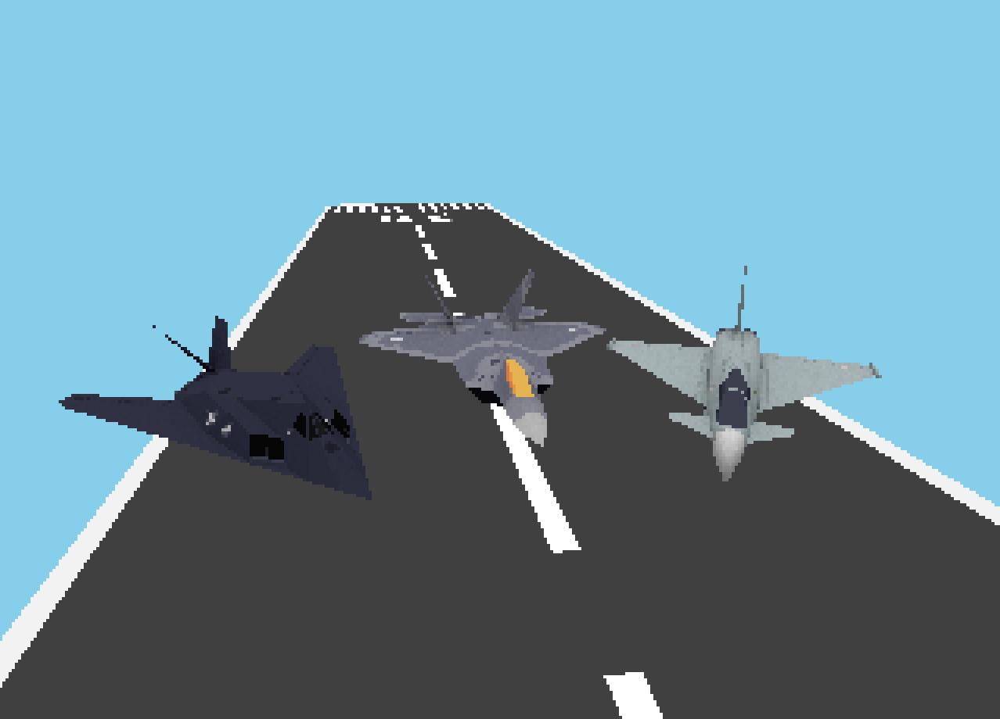
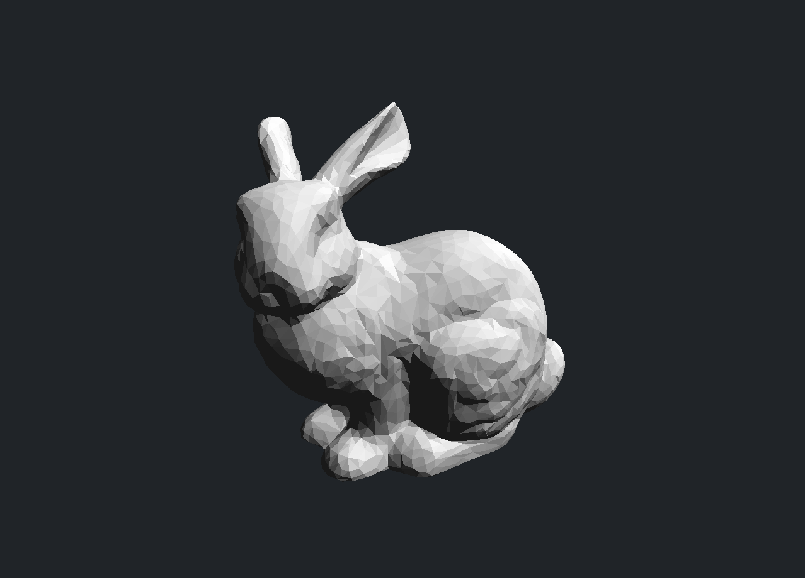

# Basic rendering

A from-scratch software renderer, running the full 3D pipeline on the CPU.

This is the first demo for 2real, focused on rendering.

## Features

- 320x240 resolution to match the peak computing performance of the PS1.
    - Also supports custom resolutions and scaling factors.
- Perspective camera with Sutherland–Hodgman frustum clipping and backface culling.
- Per-pixel depth testing via a W-buffer.
- Flat, textured, or wireframe rendering, with basic directional lighting.
- Perspective-correct texture mapping.
- Pineda rasterization with incremental exact-integer edge functions.
- Sub-pixel precision rasterization with top-left fill rule.
- Basic OBJ file loading.
- Controller support with FPS camera controls.

## Screenshots

https://github.com/user-attachments/assets/363f0741-a8d9-4809-be3c-a14b031d933a

The video demo is also available [here](./planes.mp4).
